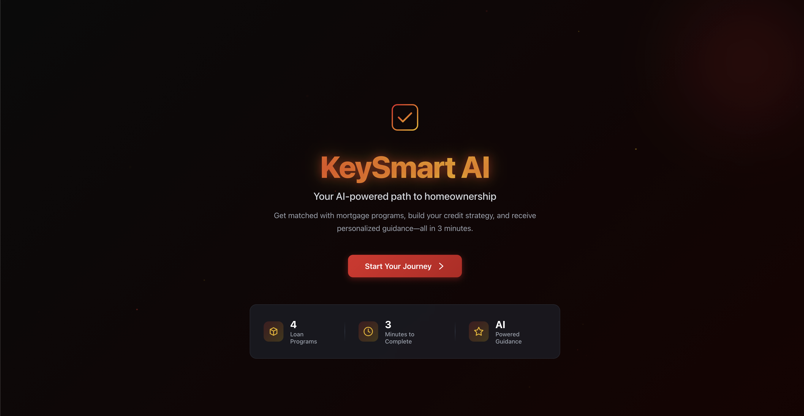
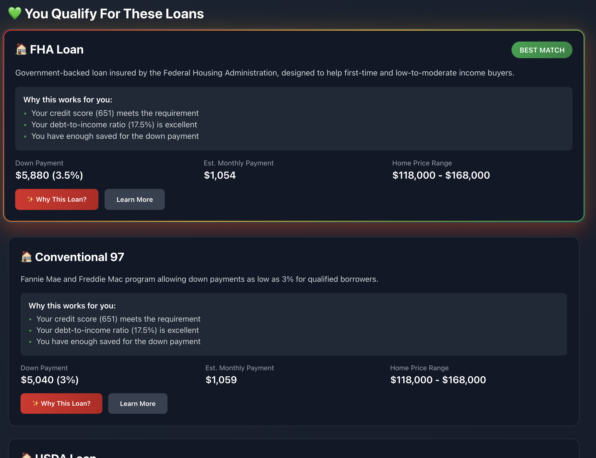
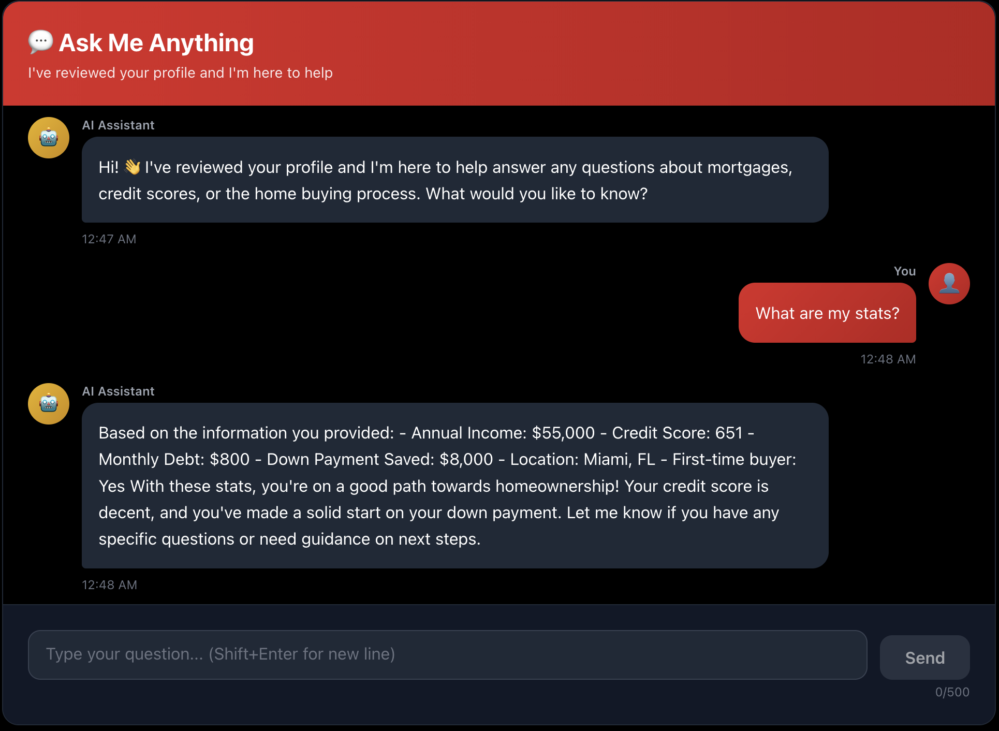

# KeySmart AI

**🥇 Winner - NSBE Fall Region III Conference Hackathon**

AI-powered platform that helps first-time homebuyers navigate federal mortgage programs and close the racial homeownership gap.

---

## The Problem

- **44%** Black homeownership vs **74%** White homeownership
- **$300K** median wealth gap per household
- **72%** of buyers don't know they qualify for federal programs

---

## The Solution

**3 AI Features:**
1. **Readiness Analyzer** - Instant eligibility matching to FHA, VA, USDA loans
2. **AI Explanations** - Plain-language answers to "Why do I qualify?"
3. **24/7 Chat Assistant** - Context-aware mortgage guidance

---

## Tech Stack

- **Frontend:** Next.js 14, React, TypeScript, Tailwind CSS
- **AI:** OpenAI GPT-3.5
- **Data:** FHA/VA/USDA requirements, HUD API
- **Deployed:** Vercel

---

## Live Demo

https://key-smart-ai.vercel.app/
---

## Screenshots





---

## Quick Start

```bash
git clone [your-repo-url]
cd keysmart-ai
npm install
echo "OPENAI_API_KEY=your_key" > .env.local
npm run dev
```

Open `http://localhost:3000`

---

## Impact

**Year 1 Projection:**
- 10,000 users → 3,000 matches → $225M in mortgages

---

## Contact

**[Your Name]**  
antoinemorrison122@gmail.com

---

**Built to close the homeownership gap** ❤️
